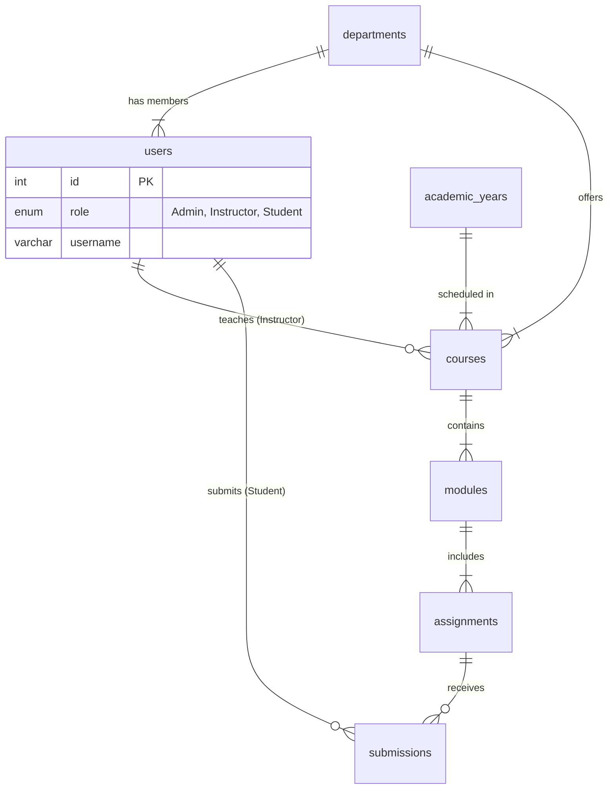

# Database Documentation (LMS_DB)

## 1. Overview
The **LMS_DB** is a relational MySQL database designed to manage users, courses, and educational content. It uses **Foreign Keys** to strictly enforce relationships (e.g., a Course *must* belong to an Instructor).

**Database Name**: `LMS_DB`
**Dialect**: MySQL 8.x

---

## 2. Entity-Relationship Diagram (ERD)

---

## 3. Table Details

### 3.1. Core System Tables

#### **`departments`**
Categorizes users and courses (e.g., "Computer Science", "Mathematics").
| Column | Type | Constraints | Description |
| :--- | :--- | :--- | :--- |
| `id` | `INT` | `PK`, `AUTO_INCREMENT` | Unique identifier. |
| `name` | `VARCHAR(100)` | `NOT NULL`, `UNIQUE` | Department name. |
| `description` | `TEXT` | | Optional details. |
| `created_at` | `TIMESTAMP` | `DEFAULT NOW()` | Record creation time. |

#### **`academic_years`**
Defines the timeline for courses (e.g., "2024-2025").
| Column | Type | Constraints | Description |
| :--- | :--- | :--- | :--- |
| `id` | `INT` | `PK`, `AUTO_INCREMENT` | Unique identifier. |
| `year_name` | `VARCHAR(20)` | `NOT NULL`, `UNIQUE` | Label (e.g., "2024-2025"). |
| `start_date` | `DATE` | | Semester start. |
| `end_date` | `DATE` | | Semester end. |
| `is_active` | `BOOLEAN` | `DEFAULT TRUE` | If true, currently in session. |

---

### 3.2. User Management

#### **`users`**
Stores all actors in the system.
| Column | Type | Constraints | Description |
| :--- | :--- | :--- | :--- |
| `id` | `INT` | `PK`, `AUTO_INCREMENT` | Unique identifier. |
| `username` | `VARCHAR(50)` | `NOT NULL`, `UNIQUE` | Login username. |
| `password` | `VARCHAR(100)` | `NOT NULL` | Plain text (demo) or hashed password. |
| `role` | `ENUM` | `NOT NULL` | Values: `'Admin'`, `'Instructor'`, `'Student'`, `'Locked'`. |
| `profile_image`| `LONGBLOB` | | User avatar image binary data. |
| `department_id`| `INT` | `FK -> departments(id)` | User's department. |
| `academic_year_id`| `INT` | `FK -> academic_years(id)`| User's active year. |

---

### 3.3. Course Content

#### **`courses`**
The main container for learning material.
| Column | Type | Constraints | Description |
| :--- | :--- | :--- | :--- |
| `id` | `INT` | `PK`, `AUTO_INCREMENT` | Unique identifier. |
| `title` | `VARCHAR(100)`| `NOT NULL` | Course Name. |
| `description` | `TEXT` | | Details about the course. |
| `instructor_id`| `INT` | `FK -> users(id)` | The teacher (Cascade Delete). |
| `course_image` | `LONGBLOB` | | Cover image for the dashboard. |

#### **`modules`**
Units within a course (Chapter 1, Week 1, etc.).
| Column | Type | Constraints | Description |
| :--- | :--- | :--- | :--- |
| `id` | `INT` | `PK`, `AUTO_INCREMENT` | Unique identifier. |
| `course_id` | `INT` | `FK -> courses(id)` | Parent course (Cascade Delete). |
| `title` | `VARCHAR(100)`| `NOT NULL` | Module name. |
| `module_data` | `LONGBLOB` | | **File Storage**: The actual PDF/PPT file. |
| `file_type` | `VARCHAR(10)` | | Extension (e.g., "pdf"). |

---

### 3.4. Assessment

#### **`assignments`**
Tasks linked to a module.
| Column | Type | Constraints | Description |
| :--- | :--- | :--- | :--- |
| `id` | `INT` | `PK`, `AUTO_INCREMENT` | Unique identifier. |
| `module_id` | `INT` | `FK -> modules(id)` | Parent module (Cascade Delete). |
| `description` | `TEXT` | | Instructions. |
| `max_score` | `INT` | | Maximum points possible. |
| `due_date` | `DATE` | | Deadline. |
| `assignment_data`| `LONGBLOB` | | **File Storage**: Instruction file. |

#### **`submissions`**
Student work uploaded for an assignment.
| Column | Type | Constraints | Description |
| :--- | :--- | :--- | :--- |
| `id` | `INT` | `PK`, `AUTO_INCREMENT` | Unique identifier. |
| `assignment_id`| `INT` | `FK -> assignments(id)`| The target assignment. |
| `student_id` | `INT` | `FK -> users(id)` | The student uploading. |
| `submission_data`| `LONGBLOB` | | **File Storage**: The student's solution. |
| `score` | `INT` | `DEFAULT NULL` | Grade given by instructor. |
| `feedback_text`| `TEXT` | | Comments from instructor. |

---

## 4. Initialization Data
The database is pre-seeded with:
- **Default Department**: "General"
- **Default Years**: "2024-2025" (Active), "2025-2026"
- **Default Users**:
    - `admin` (Role: Admin)
    - `instructor` (Role: Instructor)
    - `student` (Role: Student)
    - `locked_user` (Role: Locked)

---
**Generated by Antigravity**
