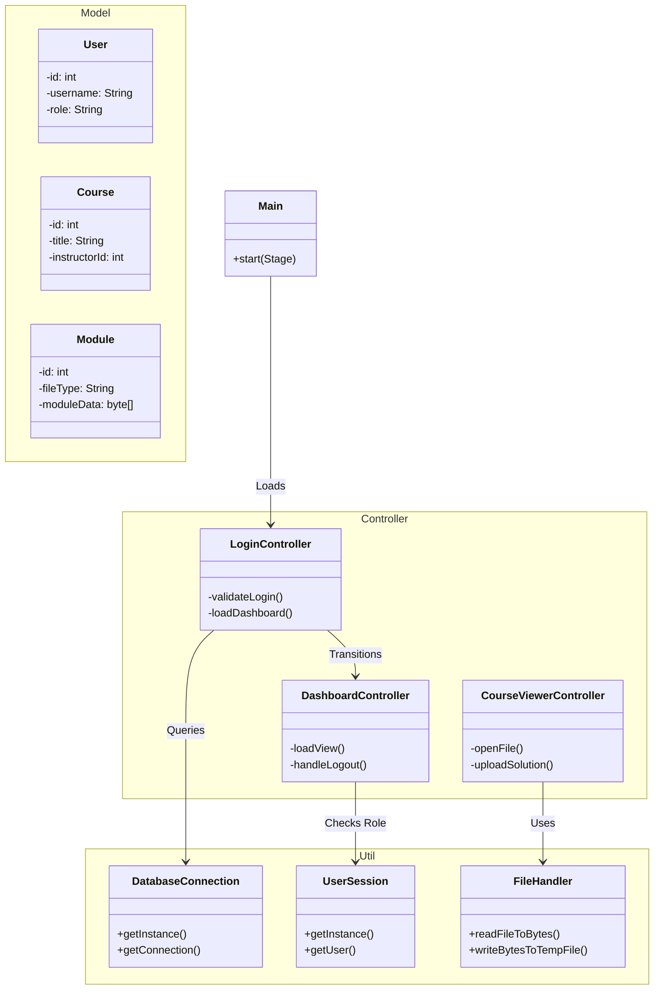
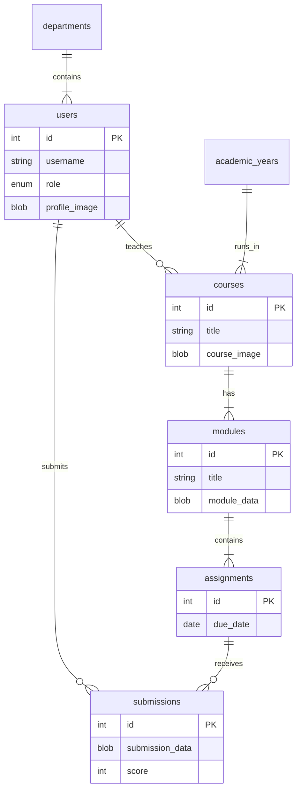

# LMS Project Documentation

## 1. Project Overview
This project is a **Learning Management System (LMS)** built with **Java** and **JavaFX**. It follows the **Model-View-Controller (MVC)** architectural pattern to ensure clean code separation, maintainability, and scalability.

The system allows uses to:
- **Admin**: Manage departments, academic years, and system settings.
- **Instructor**: Create courses, manage modules, assignments, and grade submissions.
- **Student**: View courses, download content, upload assignments, and view grades.

---

## 2. Technical Stack
- **Language**: Java 21
- **GUI Framework**: JavaFX 21
- **Build Tool**: Maven
- **Database**: MySQL 8.x
- **Dependencies**:
    - `javafx-controls`, `javafx-fxml`, `javafx-graphics`, `javafx-base`: For UI.
    - `mysql-connector-j`: For database connectivity.

---

## 3. Architecture & Class Diagram

The project is structured into three main layers:



---

## 4. Deep Dive: Key Workflows

### 4.1. Authentication Flow
**Goal**: Verify user identity and establish a session.

1.  **User Input**: User enters credentials in `LoginView.fxml`.
2.  **Validation** (`LoginController.validateLogin`):
    - Connects to DB via `DatabaseConnection`.
    - Queries `users` table: `SELECT * FROM users WHERE username=? AND password=?`.
    - **Security Check**: If `role == 'Locked'`, login is denied immediately.
3.  **Session Creation**:
    - If valid, `UserSession.getInstance(...)` is called with user details (ID, Role, Dept).
    - This singleton instance persists throughout the app lifecycle.
4.  **Navigation**: `DashboardView.fxml` is loaded.

### 4.2. File Management (BLOB Storage)
**Goal**: Store assignments and course content directly in the database.

**Upload Process (Saving to DB)**:
1.  **Selection**: User picks a file via `FileChooser` (`CourseManagerController` or `CourseViewerController`).
2.  **Conversion**: `FileHandler.readFileToBytes(File)` reads the file into a `byte[]` array.
3.  **Persistence**: The byte array is stored in a `LONGBLOB` column (e.g., `modules.module_data`) via JDBC.

**Download Process (Viewing from DB)**:
1.  **Retrieval**: The app queries the DB for the `byte[]` data.
2.  **Reconstruction**: `FileHandler.writeBytesToTempFile(data, name)` writes the bytes to a temporary file in the OS temp directory.
3.  **Opening**: `Desktop.getDesktop().open(tempFile)` launches the file in the default system application (PDF viewer, Word, etc.).

---

## 5. Database Schema (ERD)

The database `LMS_DB` uses foreign keys to maintain data integrity.



---

## 6. How to Run

1.  **Database Setup**:
    - Ensure MySQL is running on `localhost:3306`.
    - Execute `src/main/resources/schema.sql` to create `LMS_DB`.
2.  **Configuration**:
    - Open `src/main/resources/config.properties`.
    - Set `db.user` and `db.password` to your MySQL credentials.
3.  **Launch**:
    ```bash
    mvn clean javafx:run
    ```

---

## 7. Code-Level Implementation Details

### 7.1. Design Patterns Used

#### **Singleton Pattern (`UserSession`)**
- **Why?** We need a single, globally accessible instance to store the current user's data (ID, Role) that persists across all screens.
- **Implementation**: The `getInstance()` method ensures only one object is created.
- **Usage**: `UserSession.getInstance().getRole()` allows any controller to check permissions without passing user objects around manually.

#### **MVC (Model-View-Controller)**
- **Why?** separation of concerns.
    - **Model**: Plain Java objects (POJOs) like `User`, `Course`. They know nothing about the UI.
    - **View**: FXML files. They define the look but contain no logic.
    - **Controller**: Java classes. They handle events (clicks), query the DB, and update the UI.

### 7.2. Security Measures

#### **SQL Injection Prevention**
- **Mechanism**: We use `PreparedStatement` instead of concatenating strings.
- **Example**:
    ```java
    // SAFE
    String query = "SELECT * FROM users WHERE username = ?";
    stmt = conn.prepareStatement(query);
    stmt.setString(1, inputUsername);
    ```
    - This ensures that if a user types `' OR '1'='1`, it is treated as a literal string, not executable SQL.

### 7.3. JavaFX Mechanics

#### **FXML Loading**
- **How it works**: `FXMLLoader.load(getClass().getResource("..."))` reads the XML file and creates the Java objects defined in it (Buttons, Labels).
- **Controller Injection**: The `fx:controller` attribute in the FXML file tells JavaFX which class to instantiate to handle events for that view.

#### **Scene Switching**
- **Strategy**: We don't close the application window; we swap the `Scene` content on the primary `Stage`.
- **Code**: `stage.setScene(newScene)` cleanly transitions from Login to Dashboard.

---
**Generated by Antigravity**
